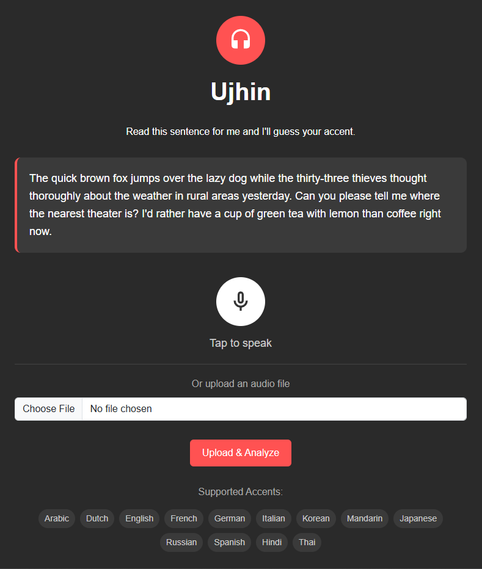
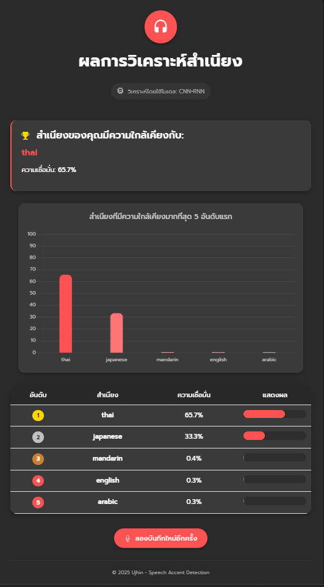

# Speech_Accent_Detection
Ujhin เป็นแอพพลิเคชันที่ใช้ปัญญาประดิษฐ์ในการระบุสำเนียงภาษาจากไฟล์เสียงพูด โดยรองรับการทำนาย 13 สำเนียงภาษาต่างๆ จากทั่วโลก

## คุณสมบัติ

- 🎤 **บันทึกเสียงโดยตรง**: บันทึกเสียงจากไมโครโฟนได้ทันที
- 📁 **อัปโหลดไฟล์เสียง**: รองรับการอัปโหลดไฟล์เสียงหลายรูปแบบ (WAV, MP3, ฯลฯ)
- 🌐 **รองรับ 13 สำเนียง**: ทำนายสำเนียงภาษา Arabic, Dutch, English, French, German, Italian, Korean, Mandarin, Russian, Japanese , Spanish, Russian, Hindi และ Thai
- 📊 **การแสดงผลด้วยกราฟ**: แสดงผลการทำนายในรูปแบบกราฟและตารางที่เข้าใจง่าย

## ตัวอย่างหน้าจอ

### หน้าแรก


### หน้าผลลัพธ์


## ความต้องการของระบบ

- Python 3.7 หรือใหม่กว่า
- TensorFlow 2.x
- Flask
- librosa
- soundfile
- และไลบรารีอื่นๆ ตามที่ระบุใน requirements.txt

## การติดตั้ง

1. โคลนโปรเจคนี้:
   ```bash
   git clone https://github.com/yourusername/ujhin-accent-detection.git
   cd ujhin-accent-detection
   ```

2. สร้างและเปิดใช้งาน virtual environment (แนะนำ):
   ```bash
   # สำหรับ Windows
   python -m venv .venv
   .venv\Scripts\activate

   # สำหรับ macOS/Linux
   python -m venv .venv
   source .venv/bin/activate
   ```

3. ติดตั้งไลบรารีที่จำเป็น:
   ```bash
   pip install -r requirements.txt
   ```

4. ดาวน์โหลดไฟล์โมเดล:
   ```bash
   # สร้างโฟลเดอร์ Model
   mkdir -p Model
   
   # ดาวน์โหลดโมเดล (สามารถดาวน์โหลดจาก link ที่แชร์ หรือใช้คำสั่ง wget/curl)
   # ตัวอย่าง:
   wget -O Model/cnn_tunning.h5 https://example.com/path/to/model
   ```

   หรือดาวน์โหลดโมเดลจาก[ลิงก์นี้](https://drive.google.com/file/d/YOUR_MODEL_FILE_ID/view) แล้วเก็บไว้ในโฟลเดอร์ `Model` ภายใต้ชื่อ `cnn_tunning.h5`

## การใช้งาน

1. เริ่มต้นเซิร์ฟเวอร์:
   ```bash
   python app.py
   ```

2. เปิดเว็บเบราว์เซอร์และไปที่:
   ```
   http://127.0.0.1:5000
   ```

3. คุณสามารถ:
   - กดปุ่มไมโครโฟนเพื่อบันทึกเสียงและกด "Analyze Accent" เพื่อวิเคราะห์
   - หรืออัปโหลดไฟล์เสียงและกด "Upload & Analyze" เพื่อวิเคราะห์

## โครงสร้างโปรเจค

```
ujhin-accent-detection/
├── app.py                  # Flask application
├── requirements.txt        # ไลบรารีที่จำเป็น
├── Model/                  # โฟลเดอร์สำหรับโมเดล
│   └── cnn_tunning.h5      # โมเดล CNN สำหรับการทำนายสำเนียง
├── static/                 # ไฟล์ static
│   └── js/                 # JavaScript files
│       └── recorder.js     # สคริปต์สำหรับบันทึกเสียง
├── templates/              # HTML templates
│   ├── index.html          # หน้าแรก
│   └── result.html         # หน้าแสดงผลลัพธ์
└── temp_audios/            # โฟลเดอร์สำหรับเก็บไฟล์เสียงชั่วคราว
```

## การแก้ไขปัญหา

### ปัญหาในการบันทึกเสียง
- ตรวจสอบว่าเบราว์เซอร์ของคุณได้รับอนุญาตให้เข้าถึงไมโครโฟน
- หากไม่สามารถบันทึกได้ ให้ลองใช้วิธีอัปโหลดไฟล์เสียงแทน

### ปัญหาในการประมวลผลไฟล์เสียง
- ตรวจสอบว่าได้ติดตั้งไลบรารี `soundfile` แล้ว
- สำหรับไฟล์ MP3 อาจต้องติดตั้ง `pydub` และ `ffmpeg` เพิ่มเติม:
  ```bash
  pip install pydub
  ```
  และติดตั้ง ffmpeg ตามระบบปฏิบัติการของคุณ

### ปัญหาในการโหลดโมเดล
- ตรวจสอบว่ามีไฟล์โมเดล `cnn_tunning.h5` อยู่ในโฟลเดอร์ `Model` แล้ว
- หากมีปัญหา ให้ลองอัปเดต TensorFlow เป็นเวอร์ชันล่าสุด

## เอกสารอ้างอิง

- [TensorFlow Documentation](https://www.tensorflow.org/api_docs)
- [Flask Documentation](https://flask.palletsprojects.com/)
- [librosa Documentation](https://librosa.org/doc/latest/index.html)

## ผู้พัฒนา

พัฒนาโดย [Your Name]
คณะ/ภาควิชา [Your Department]
มหาวิทยาลัย [Your University]

## ลิขสิทธิ์

© 2025 [Your Name]. สงวนลิขสิทธิ์ทั้งหมด.
