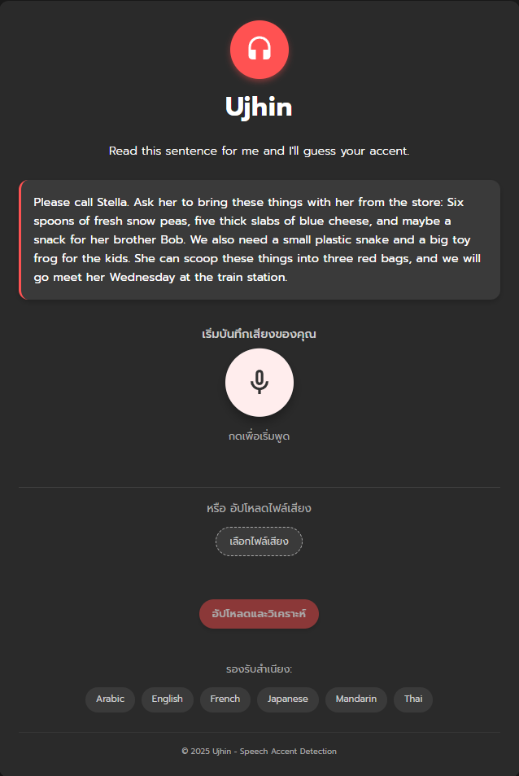
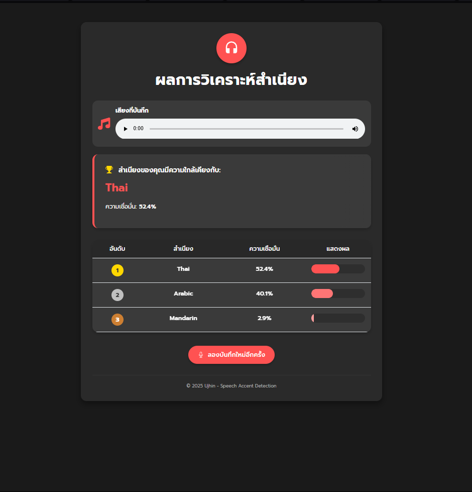

<<<<<<< HEAD
# Mini-project - ระบบตรวจจับสำเนียงการพูด

**Ujhin** คือเว็บแอปพลิเคชันที่ขับเคลื่อนด้วย AI ที่สามารถระบุและจัดประเภทสำเนียงการพูดจากตัวอย่างเสียง อัปโหลดไฟล์เสียงหรือบันทึกเสียงของคุณเพื่อค้นพบว่าการพูดของคุณคล้ายกับสำเนียงใดมากที่สุด

 
## 🌍 สำเนียงที่รองรับ

ปัจจุบันระบบสามารถตรวจจับสำเนียงต่อไปนี้:
- ไทย
- อังกฤษ
- จีนกลาง
- อาหรับ
- ญี่ปุ่น
- ฮินดี

## ✨ คุณสมบัติ

- **บันทึกเสียงแบบเรียลไทม์** ผ่านไมโครโฟนในเบราว์เซอร์
- **รองรับการอัปโหลดไฟล์เสียง** ในรูปแบบต่างๆ (MP3, WAV, M4A)
- **ไฟล์เสียงตัวอย่าง** สำหรับทดสอบและเปรียบเทียบ
- **อินเทอร์เฟซที่สวยงามและตอบสนอง** พร้อมการแสดงผลแบบเคลื่อนไหว
- **การวิเคราะห์สำเนียงอย่างละเอียด** พร้อมคะแนนความมั่นใจและการแสดงผล

## 🛠️ เทคโนโลยีที่ใช้

- **แบ็กเอนด์:** Python กับ FastAPI
- **ฟรอนต์เอนด์:** HTML, CSS, JavaScript, Bootstrap
- **AI/ML:** TensorFlow, Keras (โมเดลแบบผสม CNN-RNN และ ResNet ensemble)
- **การประมวลผลเสียง:** Librosa, PyDub, OpenCV

## 🗂️ โครงสร้างโปรเจค

```
├── app/
│   ├── models/               # โมเดลเครื่องเรียนรู้ที่ผ่านการฝึกสอนแล้ว
│   │   ├── accent_cnn_rnn_model.h5
│   │   ├── accent_ensemble_model_1.h5
│   │   ├── accent_ensemble_model_2.h5
│   │   ├── accent_resnet_model.h5
│   │   └── label_encoder.pkl
│   ├── samples/              # ไฟล์เสียงตัวอย่างสำหรับแต่ละสำเนียง
│   │   ├── arabic12.mp3
│   │   ├── english3.mp3
│   │   ├── hindi12.mp3
│   │   ├── japanese22.mp3
│   │   ├── mandarin39.mp3
│   │   └── thai7.mp3
│   ├── static/               # ไฟล์สถิต (CSS, JS, รูปภาพ)
│   ├── templates/            # เทมเพลต HTML
│   │   ├── index.html
│   │   └── result.html
│   ├── uploads/              # ไดเรกทอรีชั่วคราวสำหรับไฟล์เสียงที่อัปโหลด
│   ├── audio_processor.py    # ยูทิลิตี้สำหรับประมวลผลเสียง
│   ├── main.py               # จุดเริ่มต้นแอปพลิเคชัน FastAPI
│   ├── model_utils.py        # ยูทิลิตี้สำหรับโมเดล ML
│   └── requirements.txt      # รายการแพ็คเกจ Python ที่ต้องการ
```

=======
# Mini-project  - ระบบตรวจจับสำเนียงการพูด
**Ujhin** คือเว็บแอปพลิเคชันที่ใช้ AI สามารถระบุและจัดประเภทสำเนียงการพูดจากตัวอย่างเสียง อัปโหลดไฟล์เสียงหรือบันทึกเสียงของคุณเพื่อค้นพบว่าการพูดของคุณคล้ายกับสำเนียงใดมากที่สุด

 
## 🌍 สำเนียงที่รองรับ

ปัจจุบันระบบสามารถตรวจจับสำเนียงต่อไปนี้:
- ไทย
- อังกฤษ
- จีนกลาง
- อาหรับ
- ญี่ปุ่น
- ฮินดี

## ✨ คุณสมบัติ

- **บันทึกเสียงแบบเรียลไทม์** ผ่านไมโครโฟนในเบราว์เซอร์
- **รองรับการอัปโหลดไฟล์เสียง** ในรูปแบบต่างๆ (MP3, WAV, M4A)
- **ไฟล์เสียงตัวอย่าง** สำหรับทดสอบและเปรียบเทียบ
- **อินเทอร์เฟซที่สวยงามและตอบสนอง** พร้อมการแสดงผลแบบเคลื่อนไหว
- **การวิเคราะห์สำเนียงอย่างละเอียด** พร้อมคะแนนความมั่นใจและการแสดงผล

## 🛠️ เทคโนโลยีที่ใช้

- **แบ็กเอนด์:** Python กับ FastAPI
- **ฟรอนต์เอนด์:** HTML, CSS, JavaScript, Bootstrap
- **AI/ML:** TensorFlow, Keras (โมเดลแบบผสม CNN-RNN และ ResNet ensemble)
- **การประมวลผลเสียง:** Librosa, PyDub, OpenCV

## 🗂️ โครงสร้างโปรเจค

```
├── app/
│   ├── model.ipynb           # codeสำหรับสร้างโมเดล
│   ├── models/               # โมเดลเครื่องเรียนรู้ที่ผ่านการฝึกสอนแล้ว
│   │   ├── accent_cnn_rnn_model.h5
│   │   ├── accent_ensemble_model_1.h5
│   │   ├── accent_ensemble_model_2.h5
│   │   ├── accent_resnet_model.h5
│   │   └── label_encoder.pkl
├── ├── main_datadset/        # dataset
│   │   ├── arabic/
│   │   ├── english/
│   │   ├── hindi/
│   │   ├── japanese/
│   │   └── mandarin/
│   │   └── thai/
│   ├── samples/              # ไฟล์เสียงตัวอย่างสำหรับแต่ละสำเนียง
│   ├── static/               # ไฟล์สถิต (CSS, JS, รูปภาพ)
│   │   └── js
│   │        └── main.js
│   ├── templates/            # เทมเพลต HTML
│   │   ├── index.html
│   │   └── result.html
│   ├── uploads/              # ไดเรกทอรีชั่วคราวสำหรับไฟล์เสียงที่อัปโหลด
│   ├── audio_processor.py    # ยูทิลิตี้สำหรับประมวลผลเสียง
│   ├── main.py               # จุดเริ่มต้นแอปพลิเคชัน FastAPI
│   ├── model_utils.py        # ยูทิลิตี้สำหรับโมเดล ML
│   └── requirements.txt      # รายการแพ็คเกจ Python ที่ต้องการ
```

>>>>>>> ba9da96cbd09f210e1081b1614bcb4b78fde8945
## 🧠 สถาปัตยกรรมโมเดล

ระบบของเราใช้โมเดล ensemble ของโมเดลการเรียนรู้เชิงลึกสองตัว:

1. **โมเดลแบบผสม CNN-RNN**
   - เลเยอร์ Convolutional สำหรับการสกัดคุณลักษณะเชิงพื้นที่
   - เลเยอร์ Bidirectional GRU สำหรับรูปแบบเชิงเวลา
   - ออกแบบมาเพื่อจับลักษณะเสียงทั้งเชิงสเปกตรัมและเชิงเวลา

2. **โมเดลที่อิงจาก ResNet**
   - สถาปัตยกรรมเครือข่ายแบบ Deep residual
   - การเชื่อมต่อแบบข้าม (Skip connections) เพื่อให้สามารถฝึกสอนเครือข่ายที่ลึกขึ้น
   - ยอดเยี่ยมในการจับรูปแบบสเปกตรัมที่ซับซ้อน

การทำนายสุดท้ายรวมผลลัพธ์จากทั้งสองโมเดลเพื่อเพิ่มความแม่นยำ

## 🔧 การติดตั้งและการตั้งค่า

### สิ่งที่ต้องมีก่อน

- Python 3.8 หรือสูงกว่า
- ตัวจัดการแพ็คเกจ pip
- FFmpeg (จำเป็นสำหรับการแปลงไฟล์เสียง)

### ขั้นตอนการติดตั้ง

1. โคลนที่เก็บ:
   ```bash
<<<<<<< HEAD
   git clone https://github.com/yourusername/ujhin-accent-detection.git
   cd ujhin-accent-detection
=======
   git clone https://github.com/UJhinN/Speech_Accent_Detection.git
   cd Speech_Accent_Detection.git
>>>>>>> ba9da96cbd09f210e1081b1614bcb4b78fde8945
   ```

2. ติดตั้งแพ็คเกจที่จำเป็น:
   ```bash
   pip install -r requirements.txt
   ```

3. ติดตั้ง FFmpeg (จำเป็นสำหรับ PyDub และการแปลงไฟล์เสียง):

   **สำหรับ Ubuntu/Debian:**
   ```bash
   sudo apt update
   sudo apt install ffmpeg
   ```

   **สำหรับ macOS (ใช้ Homebrew):**
   ```bash
   brew install ffmpeg
   ```

   **สำหรับ Windows:**
   - ดาวน์โหลด FFmpeg จาก [เว็บไซต์อย่างเป็นทางการ](https://ffmpeg.org/download.html)
   - แตกไฟล์และเพิ่มโฟลเดอร์ bin ไปยัง PATH ของระบบ

4. สร้างไดเรกทอรีที่จำเป็น:
   ```bash
   mkdir -p uploads
   ```

5. รันแอปพลิเคชัน:
   ```bash
   uvicorn main:app --reload --host 0.0.0.0 --port 8000
   ```

6. เข้าถึงเว็บอินเทอร์เฟซที่ `http://localhost:8000`

## 📊 ชุดข้อมูลและการฝึกสอน

โมเดลได้รับการฝึกสอนจากชุดข้อมูลหลากหลายของตัวอย่างเสียงพูดจากหลายภาษาและสำเนียง คุณลักษณะหลักที่ใช้ในการฝึกสอนประกอบด้วย:
<<<<<<< HEAD

- สเปกโตรแกรม Mel (Mel spectrograms)
- MFCCs (สัมประสิทธิ์เซปสตรัมความถี่ Mel)
- Delta MFCCs

กระบวนการฝึกสอนใช้เทคนิคต่างๆ เพื่อเพิ่มประสิทธิภาพของโมเดล:
- การขยายข้อมูล (การยืดเวลา, การเปลี่ยนระดับเสียง)
- การถ่วงน้ำหนักคลาสสำหรับตัวอย่างที่ไม่สมดุล
- การหยุดก่อนกำหนดและการลดอัตราการเรียนรู้เมื่อถึงจุดอิ่มตัว

## 🚀 การใช้งาน

1. เยี่ยมชมเว็บอินเทอร์เฟซ
2. บันทึกเสียงของคุณโดยอ่านข้อความตัวอย่างหรืออัปโหลดไฟล์เสียง
3. คลิก "วิเคราะห์สำเนียง" เพื่อประมวลผลเสียงพูดของคุณ
4. ดูผลลัพธ์โดยละเอียดที่แสดงความน่าจะเป็นของสำเนียงและคะแนนความมั่นใจ

## 📋 เอกสาร API

แอปพลิเคชันมี API แบบ RESTful สำหรับการวิเคราะห์สำเนียง:

- `POST /upload` - อัปโหลดและวิเคราะห์ไฟล์เสียง
- `POST /record` - ประมวลผลเสียงที่บันทึกจากเบราว์เซอร์
- `GET /samples/{filename}` - วิเคราะห์ไฟล์เสียงตัวอย่าง

## 🤝 การมีส่วนร่วม

=======
- โหลด data จาก [Kaggle](https://www.kaggle.com/code/taliyameyswara/speech-accent-detection-using-cnn/input/)
- ข้อมูลได้มาน้อยเลยใช้ data augmentation เพื่อเพิ่ม data ให้มีจำนวนเท่ากัน
#### สกัดคุณลักษณะของเสียง
- สเปกโตรแกรม Mel (Mel spectrograms)
- MFCCs (สัมประสิทธิ์เซปสตรัมความถี่ Mel)
- Delta MFCCs

กระบวนการฝึกสอนใช้เทคนิคต่างๆ เพื่อเพิ่มประสิทธิภาพของโมเดล:
- การขยายข้อมูล (การยืดเวลา, การเปลี่ยนระดับเสียง)
- การถ่วงน้ำหนักคลาสสำหรับตัวอย่างที่ไม่สมดุล
- การหยุดก่อนกำหนดและการลดอัตราการเรียนรู้เมื่อถึงจุดอิ่มตัว

## 🚀 การใช้งาน

1. เยี่ยมชมเว็บอินเทอร์เฟซ
2. บันทึกเสียงของคุณโดยอ่านข้อความตัวอย่างหรืออัปโหลดไฟล์เสียง
3. คลิก "วิเคราะห์สำเนียง" เพื่อประมวลผลเสียงพูดของคุณ
4. ดูผลลัพธ์โดยละเอียดที่แสดงความน่าจะเป็นของสำเนียงและคะแนนความมั่นใจ

## 📋 เอกสาร API

แอปพลิเคชันมี API แบบ RESTful สำหรับการวิเคราะห์สำเนียง:

- `POST /upload` - อัปโหลดและวิเคราะห์ไฟล์เสียง
- `POST /record` - ประมวลผลเสียงที่บันทึกจากเบราว์เซอร์
- `GET /samples/{filename}` - วิเคราะห์ไฟล์เสียงตัวอย่าง

## 🤝 การมีส่วนร่วม

>>>>>>> ba9da96cbd09f210e1081b1614bcb4b78fde8945
ยินดีต้อนรับการมีส่วนร่วม! กรุณาส่ง Pull Request ได้เลย

1. Fork ที่เก็บ
2. สร้างสาขาคุณลักษณะของคุณ (`git checkout -b feature/amazing-feature`)
3. Commit การเปลี่ยนแปลงของคุณ (`git commit -m 'Add some amazing feature'`)
4. Push ไปยังสาขา (`git push origin feature/amazing-feature`)
5. เปิด Pull Request

## 📝 ใบอนุญาต

โปรเจคนี้อยู่ภายใต้ใบอนุญาต MIT - ดูรายละเอียดในไฟล์ LICENSE

## 🙏 กิตติกรรมประกาศ

- [Librosa](https://librosa.org/) สำหรับการสกัดคุณลักษณะเสียง
- [FastAPI](https://fastapi.tiangolo.com/) สำหรับเฟรมเวิร์กเว็บ
- [TensorFlow](https://www.tensorflow.org/) สำหรับความสามารถในการเรียนรู้ของเครื่อง
- [PyDub](https://github.com/jiaaro/pydub) สำหรับการจัดการไฟล์เสียง
- [FFmpeg](https://ffmpeg.org/) สำหรับการแปลงรูปแบบไฟล์เสียง
- [Bootstrap](https://getbootstrap.com/) สำหรับการจัดรูปแบบฟรอนต์เอนด์
